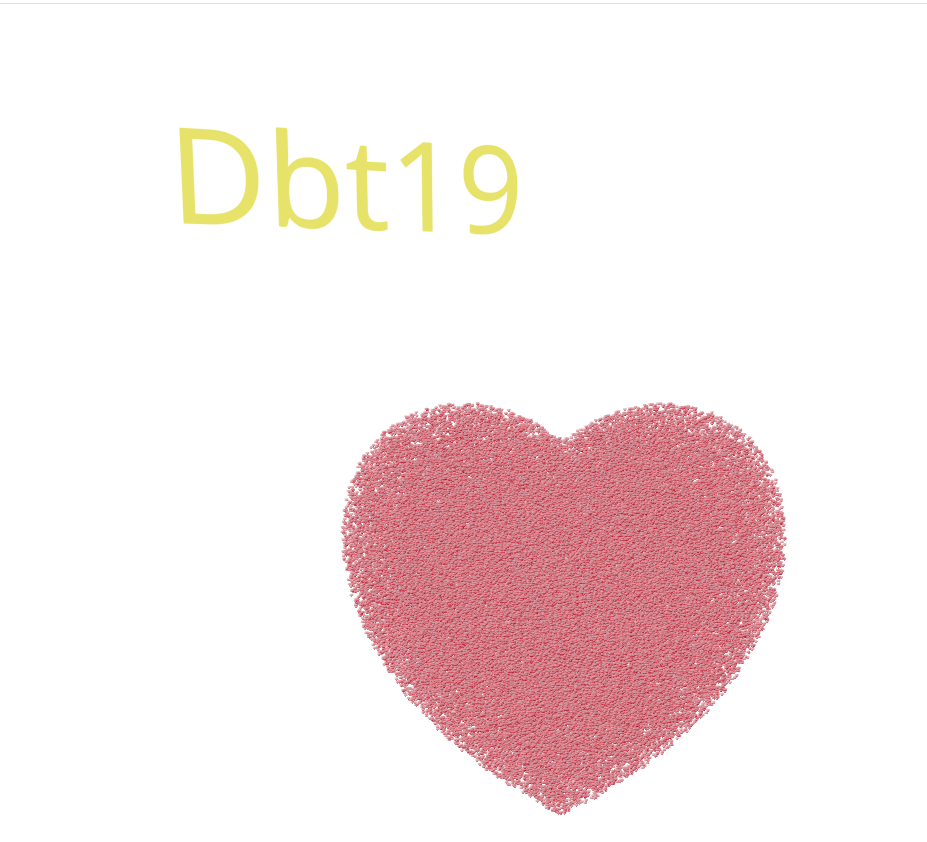
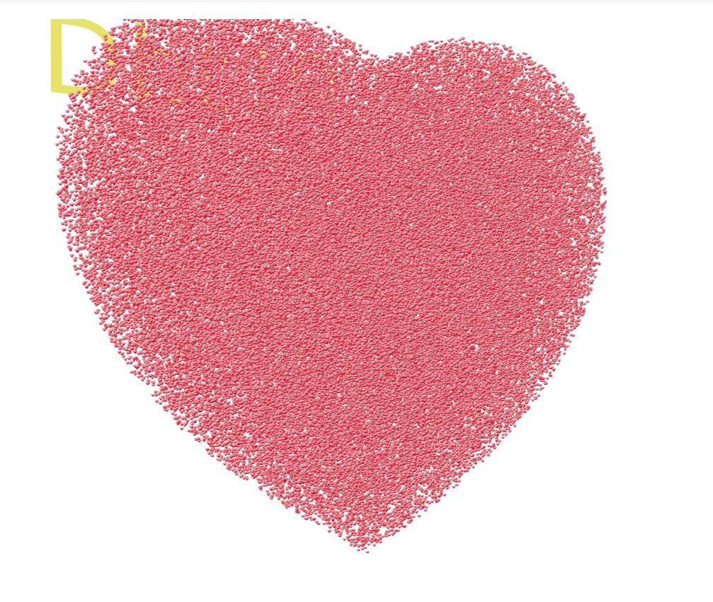

# 3D Heart Particles

A mesmerizing 3D heart particle animation built with React, TypeScript, Three.js, and Vite. This project creates an interactive scene with heart-shaped particles, background music, and customizable floating text.

## 🖼️ Screenshots





## 🧠 Tech Stack

- [React](https://react.dev)
- [TypeScript](https://www.typescriptlang.org/)
- [Vite](https://vitejs.dev)
- [Three.js](https://threejs.org/)
- [@react-three/fiber](https://docs.pmnd.rs/react-three-fiber/)
- [@react-three/drei](https://github.com/pmndrs/drei)

## 📁 Project Structure

```
3d-heart-particles/
├── public/
│   ├── heart.png           # Texture for particles
│   └── my-love/
│       └── music/
│           └── piano.mp3   # Background music
├── src/
│   ├── components/
│   │   └── ui/
│   │       └── heart.tsx   # HeartParticles component
│   ├── pages/
│   │   └── HeartPage.tsx   # Main canvas page
│   ├── App.tsx
│   └── main.tsx
├── index.html
├── package.json
├── tsconfig.json
├── vite.config.ts
└── README.md
```

## 🚀 Getting Started

### 1. Clone the repository

```bash
git clone https://github.com/dubanteo19/3d-heart
cd 3d-heart
```

### 2. Install dependencies

```bash
npm install
```

### 3. Start development server

```bash
npm run dev
```

Open your browser and go to:  
👉 [http://localhost:5173](http://localhost:5173)

## 🎮 Controls

| Action           | Key           |
|------------------|---------------|
| Move Forward     | W             |
| Move Backward    | S             |
| Strafe Left      | A             |
| Strafe Right     | D             |
| Move Up          | Space         |
| Move Down        | Shift         |
| Look Around      | Mouse         |
| Start Music      | Click anywhere |


## 🧩 Customization

### 🎵 Change background music
Replace the following file with your own:  
`public/my-love/music/piano.mp3`

### ❤️ Change heart shape texture
Replace the following with your own transparent PNG (recommend using 64x64 or 128x128):  
`public/heart.png`

### 📝 Change text
Edit the text inside `src/components/ui/heart.tsx`:

```tsx
<Text position={[0, 5, -10]} fontSize={2} color="yellow">
  Dbt19
</Text>
```

